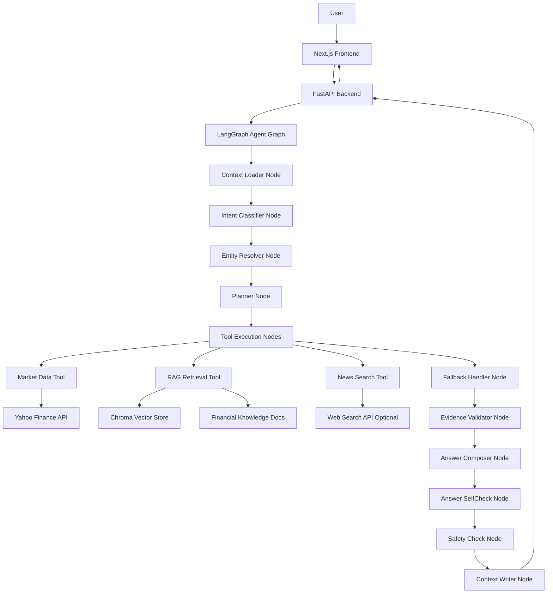
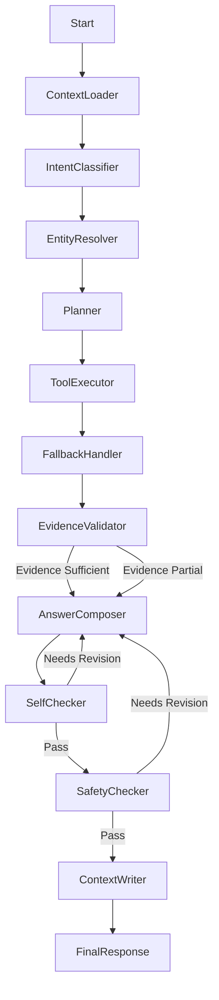
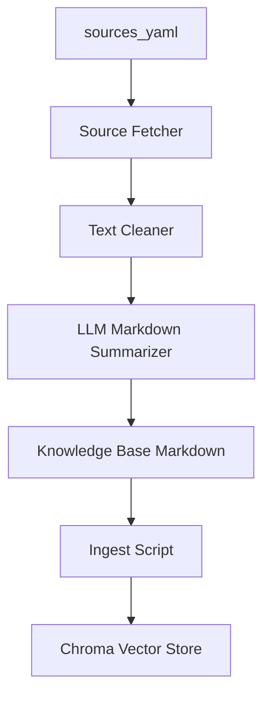

# 金融资产问答系统工程 Plan

## 目标与范围

构建一个可运行的全栈金融资产问答系统，支持两类核心问题：

- 资产行情问答：如“BABA 当前股价是多少”“最近 7 天涨跌如何”“为何 1 月 15 日大涨”。必须调用外部行情 API，并清晰区分客观价格数据与分析性描述。
- 金融知识问答：如“什么是市盈率”“收入和净利润的区别是什么”“某公司最近季度财报摘要”。通过小型知识库、文档分块、向量化和检索增强生成回答。

当前仓库 `/Users/apple/Documents/GitHub/Financial-Asset-QA-system` 基本为空，因此计划从零建立工程骨架。

## 推荐技术选型

- 前端：Next.js + TypeScript + Tailwind CSS，快速实现交互式问答界面、首页快速资产查询、当日走势可视化、结果卡片和数据来源展示。
- 后端：FastAPI + Python，适合接入行情 API、RAG、LLM 调用和数据处理。
- Agent 架构：LangGraph 状态机，显式建模意图识别、实体解析、计划生成、工具执行、证据校验、回答生成和安全检查。
- LLM：OpenAI-compatible API 抽象层，优先用环境变量配置 `OPENAI_API_KEY` / `OPENAI_BASE_URL`，避免绑定单一供应商。
- 向量检索：ChromaDB 或 FAISS。本项目数据量小，建议 ChromaDB，便于本地持久化与调试。
- Embedding：默认使用 OpenAI `text-embedding-3-small`；Embedding Provider 保持可插拔，本地多语言 fallback 使用 `BAAI/bge-m3`。暂不默认使用金融专用 embedding，除非知识库扩展到大量财报、研报、公告和电话会文本。
- RAG 方案：Evidence-Grounded RAG + 轻量 Self-Check，不做重型 Self-RAG；通过检索验证、证据校验和回答自检降低 hallucination。
- Chunking 与重排：采用结构感知 Markdown chunking；支持 query rewrite；rerank 层可插拔，默认使用轻量 LLM relevance check，cross encoder rerank 作为可选增强。
- RAG 测评：RAGAS 离线评测 pipeline，用固定测试集评估 faithfulness、answer relevancy、context precision 和 context recall。
- Fallback 机制：采用 evidence-preserving fallback。外部服务失败时优先切换备用 Provider；没有可用证据时降级回答并明确限制，禁止用模型猜测替代缺失数据。
- 上下文记忆：实现短期 session memory，支持多轮追问和资产实体延续；不做长期用户画像、投资偏好记忆或跨 session 个性化。
- 缓存策略：实现工具层分层 TTL cache，缓存行情、embedding、RAG 检索、Web Search 和部分确定性 Agent 中间结果；原则是缓存数据和证据，不缓存无来源结论。
- 知识库构建：通过脚本半自动构建 RAG 知识库，从公开金融教育页面、Wikipedia API、Yahoo Finance 公司资料和 SEC EDGAR 元数据抓取资料，清洗后生成带来源的 Markdown。
- 前端交互：支持首页 Quick Asset Lookup、当日走势可视化、SSE 流式输出、前端会话缓存、最近消息恢复和稳定 ID 规范，避免 React key 冲突或流式渲染错乱。
- 行情数据：Provider 可插拔。默认 Yahoo Finance via `yfinance`；预留 Alpha Vantage、Finnhub、Twelve Data、Financial Modeling Prep、AkShare、Stooq 等 Provider；演示时允许 fallback 到本地 demo market data 并明确标注。
- 图表渲染：使用本地 npm 图表库，如 `recharts` 或 `echarts-for-react`，不依赖 TradingView widget、Google Fonts 或外部 CDN，降低评审环境网络不稳定风险。
- 新闻/事件分析：MVP 可先用行情异常检测 + 可配置 Web Search 摘要接口；如无搜索 API key，则明确展示“未接入新闻检索，仅基于价格数据分析”。
- 容器化：Docker Compose 统一启动前端、后端和可选 Chroma 服务，保证演示和评审环境可复现。

## 系统架构



## 工程结构

建议采用前后端分离但同仓库管理：

- [frontend/](frontend/)：Next.js 应用，包含首页 Quick Asset Lookup、当日走势折线图、聊天页、示例问题、SSE 流式回答展示、前端缓存、来源展示、加载态和错误态。
- [backend/](backend/)：FastAPI 服务，包含 LangGraph Agent、行情 Provider、RAG Pipeline、LLM Client、Prompt 模板和测试。
- [knowledge_base/](knowledge_base/)：小型金融知识库 Markdown 文档，如 PE、市盈率、财报指标、收入/净利润、风险提示等。
- [backend/scripts/](backend/scripts/)：知识库构建、向量入库、评测数据准备等脚本。
- [backend/config/sources.yaml](backend/config/sources.yaml)：定义自动知识库构建的数据源、主题和公司列表。
- [backend/evals/](backend/evals/)：RAGAS 离线测评脚本、测试集和评测报告。
- [backend/app/memory/](backend/app/memory/)：短期会话记忆模块，保存最近对话和结构化金融实体。
- [docs/](docs/)：架构说明、Prompt 设计、数据来源、演示脚本。
- [README.md](README.md)：交付文档入口，包含运行方式、LangGraph 架构图、技术选型、Prompt 设计、Agent 工作流和扩展思考。
- [.env.example](.env.example)：列出必要环境变量，不提交真实密钥。
- [docker-compose.yml](docker-compose.yml)：一键启动前端、后端和向量库相关服务。
- [backend/Dockerfile](backend/Dockerfile)：后端 FastAPI 镜像。
- [frontend/Dockerfile](frontend/Dockerfile)：前端 Next.js 镜像。

## 后端设计

核心 API：

- `POST /api/ask`：统一问答入口。输入用户问题和 `session_id`，执行 LangGraph Agent，输出结构化回答、Agent 步骤、数据来源、置信提示。
- `POST /api/ask/stream`：流式问答入口。通过 SSE 或 fetch ReadableStream 返回 Agent 步骤、增量回答、最终回答和错误事件。
- `GET /api/assets/{symbol}/quote`：获取当前或最近行情数据。
- `GET /api/assets/{symbol}/history?range=7d|30d`：获取历史价格并计算涨跌幅。
- `GET /api/assets/{symbol}/intraday?interval=5m|15m`：获取当日或最近交易日的日内价格序列，用于首页走势可视化。
- `GET /api/assets/resolve?query=阿里巴巴|BABA|Tesla`：将公司名、中文名或 symbol 解析为标准资产信息，供首页快速查询使用。
- `POST /api/ingest`：开发期知识库入库接口，可选择仅本地脚本实现，不暴露到生产前端。
- `GET /api/health`：服务健康检查。

开发脚本：

- `python backend/scripts/build_knowledge_base.py`：读取 `sources.yaml`，抓取公开资料，清洗并生成 Markdown 知识库。
- `python backend/scripts/ingest_knowledge_base.py`：扫描 `knowledge_base/**/*.md`，分块、embedding 并写入 Chroma。
- `python backend/evals/run_ragas_eval.py`：运行 RAGAS 离线评测。

关键模块：

- `backend/app/agent/state.py`：定义 Agent 全局状态，如原始问题、意图、资产实体、执行计划、工具结果、证据包、最终回答。
- `backend/app/agent/graph.py`：组装 LangGraph 状态机，控制节点顺序、条件分支和错误处理。
- `backend/app/agent/nodes/context_loader.py`：根据 `session_id` 读取短期上下文，补充最近实体、意图和时间范围。
- `backend/app/agent/nodes/intent_classifier.py`：判断问题类型，输出 `market` / `knowledge` / `hybrid` / `event`。
- `backend/app/agent/nodes/entity_resolver.py`：把“阿里巴巴”“Alibaba”“BABA”等解析为标准 symbol、公司名和交易所信息。
- `backend/app/agent/nodes/planner.py`：根据意图决定调用 quote、history、RAG、news search 等工具。
- `backend/app/agent/nodes/tool_executor.py`：执行确定性工具，并把结果写入 Agent state。
- `backend/app/agent/nodes/fallback_handler.py`：处理工具或模型失败，切换备用 Provider 或生成明确降级状态。
- `backend/app/agent/nodes/evidence_validator.py`：检查行情、RAG、新闻证据是否满足回答条件；不足时生成限制说明。
- `backend/app/agent/nodes/answer_composer.py`：基于证据包调用 LLM 生成结构化 JSON 回答。
- `backend/app/agent/nodes/self_checker.py`：对生成回答进行轻量自检，确认回答是否被 evidence 支撑、是否存在未引用事实。
- `backend/app/agent/nodes/safety_checker.py`：检查是否预测未来、是否给投资建议、是否编造未提供数据。
- `backend/app/agent/nodes/context_writer.py`：回答完成后写回本轮摘要、实体、意图和时间范围。
- `backend/app/memory/session_store.py`：封装 SQLite 或内存 session memory，默认建议 SQLite。
- `backend/app/services/market_data.py`：封装 Yahoo Finance，返回标准化 quote、history、returns、trend。
- `backend/app/services/market_data_fallback.py`：预留 Alpha Vantage、Stooq 等备用行情 Provider 接口。
- `backend/app/services/demo_market_data.py`：提供本地离线 demo 行情数据，用于外部行情 API 不可用时保障演示可视化不白屏。
- `backend/app/services/embedding.py`：封装可插拔 Embedding Provider，默认 OpenAI `text-embedding-3-small`，可切换到本地 `BAAI/bge-m3`。
- `backend/app/services/chunker.py`：结构感知 Markdown chunker，按标题、段落和 token budget 切分文档。
- `backend/app/services/query_rewriter.py`：将用户问题改写为适合检索的中英混合 query，保留原始问题用于最终回答。
- `backend/app/services/reranker.py`：封装可插拔 rerank 层，默认 LLM relevance check，可选 cross encoder rerank。
- `backend/app/services/cache.py`：封装统一 cache adapter，默认 in-memory TTL cache，预留 Redis backend。
- `backend/app/services/rag.py`：加载知识库、分块、向量化、召回相关片段。
- `backend/app/services/rag_evaluator.py`：封装 RAGAS 测评入口，供离线脚本调用。
- `backend/app/services/news_search.py`：封装 Tavily、SerpAPI 或可选搜索 Provider；没有 API key 时返回明确的未配置状态。
- `backend/app/services/llm.py`：封装 OpenAI-compatible Chat Completion。
- `backend/app/prompts/answer_prompts.py`：维护资产问答、知识问答、混合问答 Prompt。
- `backend/evals/rag_eval_dataset.json`：固定 RAG 测试集，覆盖核心金融知识问题。
- `backend/evals/run_ragas_eval.py`：运行 RAGAS 指标评测并输出报告。
- `backend/scripts/build_knowledge_base.py`：根据配置自动抓取公开资料，生成带 citations 的 Markdown 文档。
- `backend/scripts/ingest_knowledge_base.py`：将生成的知识库文档写入向量库。
- `backend/config/sources.yaml`：定义金融主题、公司、来源 URL 和启用的数据源类型。
- `backend/app/schemas.py`：定义请求和响应模型，保证前端渲染稳定。

流式事件协议：

- `agent_step`：返回当前 Agent 执行步骤，如意图识别、实体解析、工具调用、证据校验。
- `partial_answer`：返回增量回答文本。
- `final_answer`：返回完整结构化回答、sources、warnings、fallback 和 self-check 状态。
- `error`：返回可展示错误信息。
- `done`：表示本次流结束。

## 轻量容器化交付

项目需要支持本地开发运行和 Docker Compose 演示运行两种方式。

本地开发：

- 后端：在项目根目录运行 `uvicorn backend.app.main:app --reload --port 8000`
- 前端：`cd frontend && npm run dev`
- 向量库：默认使用本地持久化目录，如 `backend/.chroma`

Docker Compose 演示：

- `backend` 服务运行 FastAPI，暴露 `8000`。
- `frontend` 服务运行 Next.js，暴露 `3000`。
- `chroma` 服务可选：如果使用 Chroma Server 模式，则独立服务；如果使用 embedded Chroma，则通过 volume 挂载 `backend/.chroma`。
- `.env` 注入 LLM、搜索和数据源配置。

建议环境变量：

- `OPENAI_API_KEY`：LLM API key。
- `OPENAI_BASE_URL`：OpenAI-compatible endpoint，可选。
- `OPENAI_MODEL`：聊天模型名。
- `EMBEDDING_PROVIDER`：Embedding Provider，默认 `openai`，可选 `sentence_transformers`。
- `EMBEDDING_MODEL`：Embedding 模型名，默认 `text-embedding-3-small`，本地 fallback 为 `BAAI/bge-m3`。
- `RERANK_PROVIDER`：Rerank Provider，默认 `llm_relevance`，可选 `none` 或 `cross_encoder`。
- `RERANK_MODEL`：Cross encoder rerank 模型名，可选 `BAAI/bge-reranker-base` 或 `cross-encoder/ms-marco-MiniLM-L-6-v2`。
- `CACHE_BACKEND`：缓存后端，默认 `memory`，可选 `redis`。
- `REDIS_URL`：Redis 连接地址，仅在 `CACHE_BACKEND=redis` 时需要。
- `TAVILY_API_KEY` 或 `SERPAPI_API_KEY`：Web Search，可选。
- `CHROMA_PERSIST_DIR`：向量库持久化路径。
- `NEXT_PUBLIC_API_BASE_URL`：前端访问后端的 API 地址。

README 需要提供两套启动命令：

- 开发模式：前后端分别启动，方便调试。
- 演示模式：`docker compose up --build`，方便评审复现。

容器化边界保持简单，不引入 Kubernetes、复杂 Nginx 反代或 CI/CD；本项目只需要证明工程可运行、依赖清晰、交付可复现。

## Agent 状态机设计

LangGraph 的核心目标是让“模型推理”和“工具取数”边界清晰。LLM 不直接生成事实数据，而是根据节点产出的证据包完成表达。

Agent state 建议字段：

- `question`：用户原始问题。
- `session_id`：当前会话 ID，由前端生成并随请求传入。
- `memory`：短期会话上下文，包括最近对话、上一资产实体、上一意图和上一时间范围。
- `intent`：`market` / `knowledge` / `hybrid` / `event`。
- `entities`：识别出的资产、symbol、公司名、时间范围。
- `plan`：需要调用的工具列表和参数。
- `tool_results`：行情、历史价格、RAG 片段、新闻搜索结果。
- `fallbacks`：记录是否使用 fallback、fallback provider、失败原因和降级说明。
- `evidence`：经过校验和标准化后的证据包。
- `answer`：结构化回答 JSON。
- `self_check`：回答自检结果，包括是否被证据支撑、是否存在缺失来源、是否需要降级回答。
- `steps`：可展示给前端的 Agent 执行轨迹。
- `warnings`：数据不足、API 失败、非投资建议等提示。

状态流：



节点职责：

- `ContextLoader`：加载短期 session memory，用于理解“它”“那 30 天呢”“这个公司”等省略表达。
- `IntentClassifier`：用规则 + LLM 小模型提示判断问题类型，优先保证稳定性。
- `EntityResolver`：维护常见中英文资产映射，如 `阿里巴巴 -> BABA`、`特斯拉 -> TSLA`；未知资产可让 LLM 尝试解析后再校验。
- `Planner`：生成工具执行计划，例如当前价只调 quote，7 日涨跌调 history + return calculator，原因分析调 history + news search + RAG。
- `ToolExecutor`：工具是确定性 Python 函数，Agent 只决定调用什么，不让 LLM 编造工具结果。
- `FallbackHandler`：对失败工具执行分层降级；能切换 Provider 就切换，不能切换就保留失败状态和 warning。
- `EvidenceValidator`：资产问题必须有行情数据；事件原因必须有新闻或财报来源，否则降级为“价格异动观察 + 数据不足说明”。
- `AnswerComposer`：把证据转成用户可读答案，严格输出 schema。
- `SelfChecker`：检查回答是否只基于 evidence，是否存在未引用事实，必要时要求 AnswerComposer 重写或降级。
- `SafetyChecker`：做轻量后处理，确保无投资建议、无未来预测、无未来源事实。
- `ContextWriter`：只写入短期上下文和结构化实体，不保存长期用户画像、投资偏好或敏感信息。

## 上下文记忆设计

目标：

- 支持多轮追问，例如“BABA 最近 7 天涨跌如何？”之后用户问“那 30 天呢？”。
- 支持资产实体延续，例如“特斯拉近期走势如何？”之后用户问“它现在股价是多少？”。
- 避免把完整历史无限塞给 LLM，控制 token 和隐私风险。

建议存储结构：

```json
{
  "session_id": "session-uuid",
  "recent_turns": [],
  "last_entities": {
    "symbol": "BABA",
    "company_name": "Alibaba"
  },
  "last_intent": "market",
  "last_time_range": "7d"
}
```

实现策略：

- 前端首次打开页面生成 `session_id`，后续请求都带上。
- 后端默认使用 SQLite session memory，容器化时通过 volume 持久化；2 天 MVP 可先用内存字典实现，再替换为 SQLite。
- 只保存最近 `N=6` 轮对话摘要和结构化字段，不保存完整长期历史。
- `EntityResolver` 在遇到“它”“这个公司”“那 30 天呢”时，优先使用 `last_entities` 和 `last_time_range` 补全。
- `ContextWriter` 在最终回答后写入本轮实体、意图、时间范围和简短回答摘要。

明确不做：

- 不做长期用户画像。
- 不保存投资偏好、风险偏好或个性化推荐信息。
- 不做跨 session 记忆。
- 不自动保存敏感个人信息。

## 回答格式设计

统一输出结构建议：

- `answer_type`：`market` / `knowledge` / `hybrid`
- `summary`：一句话结论
- `objective_data`：价格、涨跌幅、时间区间、数据时间戳
- `analysis`：趋势解释、可能影响因素、限制说明
- `sources`：行情 API、知识库文档、Web Search 结果
- `warnings`：非投资建议、数据延迟、未接入新闻源等
- `agent_steps`：前端可展示的执行步骤，如意图识别、实体解析、行情查询、RAG 检索、证据校验
- `cache_hit`：本轮是否命中后端工具层缓存
- `fallback_used`：是否使用备用 Provider 或降级回答
- `data_quality`：`complete` / `partial` / `unavailable`
- `memory_used`：是否使用 session memory 补全实体或时间范围

资产问题的回答原则：

- 当前价、时间戳、涨跌幅必须来自行情 API。
- 趋势判断基于可复现规则，例如 7 日涨跌幅大于 2% 为上涨，小于 -2% 为下跌，否则为震荡。
- 事件原因分析必须标注“可能原因”，不能直接断言因果。
- 若无新闻/财报来源，`EvidenceValidator` 必须把回答降级，明确说明分析仅基于价格走势和通用市场因素。

## RAG 与测评设计

知识库首批文档建议：

- `knowledge_base/valuation/pe_ratio.md`：市盈率定义、公式、适用场景和局限。
- `knowledge_base/financial_statements/revenue_vs_net_income.md`：收入与净利润区别。
- `knowledge_base/financial_statements/quarterly_report_summary.md`：季度财报摘要模板。
- `knowledge_base/market/price_change.md`：涨跌幅、收益率、波动率、趋势解释。
- `knowledge_base/risk/investment_disclaimer.md`：投资风险与非投资建议说明。

知识库数据来源：

- 金融概念：SEC Investor.gov、Nasdaq Glossary、Wikipedia API、公开金融教育页面。
- 公司静态资料：Yahoo Finance company profile、公司 Investor Relations、SEC EDGAR submissions / company facts、Wikipedia API。
- 风险说明与方法论：SEC Investor.gov、FINRA、公开投资者教育材料。

不进入 RAG 的数据：

- 当前股价、实时涨跌幅、最近 7 天或 30 天历史价格。
- 最新新闻、当日市场事件。
- 会频繁变化的财报数值。

这些实时或高频变化数据必须运行时调用行情 API、新闻搜索或财报 API。

自动知识库构建流程：



示例 `sources.yaml`：

```yaml
topics:
  - id: pe_ratio
    title: Price-to-Earnings Ratio
    category: valuation
    sources:
      - https://www.investor.gov/introduction-investing/investing-basics/glossary/price-earnings-pe-ratio
      - https://en.wikipedia.org/wiki/Price%E2%80%93earnings_ratio

companies:
  - symbol: BABA
    name: Alibaba
    category: companies
    sources:
      - yahoo_finance
      - wikipedia
      - sec_edgar

  - symbol: TSLA
    name: Tesla
    category: companies
    sources:
      - yahoo_finance
      - wikipedia
      - sec_edgar
```

生成文档格式：

```markdown
# Price-to-Earnings Ratio

## Summary
...

## Definition
...

## How to Interpret
...

## Limitations
...

## Sources

- SEC Investor.gov: ...
- Wikipedia: ...
```

版权与质量原则：

- 脚本抓取后生成摘要和结构化 Markdown，不直接复制整篇网页原文。
- 每篇文档必须保留 `Sources`，方便 RAG 回答展示出处。
- 如果抓取失败，脚本记录失败来源并继续处理其他文档。
- 生成后的知识库可以人工快速抽查，但不依赖手写全部文档。

RAG Pipeline：

- 文档加载：扫描 `knowledge_base/**/*.md`。
- 分块策略：结构感知 Markdown chunking。优先按 H1/H2/H3 标题切分，再按段落合并，最后用 token budget 控制大小；chunk size 约 500-800 tokens，overlap 约 80-120 tokens。
- Chunk metadata：每个 chunk 保存 `doc_id`、`title`、`section`、`source_urls`、`chunk_index`、`token_count`，用于检索展示、RAGAS 分析和证据校验。
- Embedding：默认 OpenAI `text-embedding-3-small`，兼顾成本、速度、中英混合检索和交付稳定性。
- Embedding fallback：可通过 `EMBEDDING_PROVIDER=sentence_transformers` 切换到 `BAAI/bge-m3`，用于本地运行或更强调多语言金融文本检索的场景。
- 金融专用 embedding：暂不作为默认模型。当前知识库规模小，收益通常低于优化文档质量、chunk 切分、query rewrite、证据校验和 Self-Check；后续如接入大量财报、研报、公告、earnings call transcript，可扩展金融领域 embedding。
- Query rewrite：将中文或口语化问题改写为 1-3 条检索 query，保留原始问题用于最终回答。例如“收入和净利润区别”可扩展为 “revenue vs net income financial statements”。
- 初始检索：向量检索 Top K 8-10，返回片段标题、文件路径、相似度和 metadata。
- Rerank / Filter：默认先做 similarity threshold，再用 LLM relevance check 从 Top K 8-10 中选出 Top K 3-5。cross encoder rerank 作为可选增强，通过 `RERANK_PROVIDER=cross_encoder` 启用。
- Evidence Validator：检查相似度、来源数量、片段是否匹配问题类型；不足时说明“知识库未覆盖完整信息”。
- 生成：LLM 必须依据检索片段回答，禁止引入未提供事实。
- Self-Check：回答生成后再检查一次是否忠实于 evidence，若不通过则重写或降级。

Rerank 选择：

- 默认选择 LLM relevance check：更容易接入当前 LLM Client，部署简单，适合小型知识库和演示项目；可以输出“为什么这个 chunk 相关”的解释，便于调试。
- Cross encoder rerank 作为可选增强：更确定、更适合批量检索质量优化，但会增加模型依赖、Docker 镜像体积和本地推理延迟。
- 如果时间充足且本地依赖可接受，优先尝试 `BAAI/bge-reranker-base`；如果追求最小部署复杂度，保持 `RERANK_PROVIDER=llm_relevance`。

不建议做完整 Self-RAG：

- 完整 Self-RAG 需要模型在生成中做反思、检索决策和 critic 判断，开发成本高。
- 本项目更适合做 Evidence-Grounded RAG，把“检索、证据校验、自检、评测”做清楚，更容易交付和演示。

RAGAS 离线评测：

- 目录：`backend/evals/`
- 测试集：`rag_eval_dataset.json`，包含 10-20 个固定问题、标准答案要点和期望来源。
- 脚本：`run_ragas_eval.py`，调用当前 RAG pipeline 生成答案，再用 RAGAS 计算指标。
- 报告：输出到 `backend/evals/reports/`，README 中展示最近一次评测摘要。

建议指标：

- `faithfulness`：回答是否忠实于检索上下文。
- `answer_relevancy`：回答是否切题。
- `context_precision`：检索到的上下文是否有用。
- `context_recall`：标准答案需要的信息是否被召回。

适用范围：

- RAGAS 主要评估金融知识类问题，如市盈率、收入与净利润、财报摘要模板。
- 行情类问题主要通过单元测试和 API 集成测试评估，因为股价和涨跌幅是实时数据，不适合用固定 RAGAS 标准答案评估。

## 后端缓存策略

核心原则：

- Cache data and evidence, not unsupported conclusions.
- 优先缓存工具结果、检索证据、embedding 和确定性中间结果；谨慎缓存最终 LLM 回答。
- 缓存命中也必须保留 `data_timestamp`、`provider` 和 `evidence_hash`，让回答可追溯。

缓存层级：

- 行情 quote：TTL 30-60 秒，key 示例 `market:quote:BABA`。
- 历史价格：TTL 5-15 分钟，key 示例 `market:history:BABA:30d`。
- Query embedding：TTL 10-30 分钟，key 示例 `embedding:query:<query_hash>:<model>`。
- RAG 检索结果：TTL 10-30 分钟，key 示例 `rag:retrieve:<query_hash>:top5`。
- Web Search 结果：TTL 30-120 分钟，key 示例 `news:BABA:2026-01-15`。
- Agent 中间判断：可缓存 query rewrite、intent classification、entity resolution，TTL 10-30 分钟。
- 最终 LLM 回答：默认不缓存；如果后续启用，必须绑定 `evidence_hash`、`data_timestamp` 和 `model`。

实现策略：

- MVP 默认使用 Python in-memory TTL cache，例如 `cachetools.TTLCache`。
- 保留 Redis adapter，`CACHE_BACKEND=redis` 时切换到 Redis，便于 Docker Compose 扩展。
- Cache lookup 放在 tool/service 层，不放在前端，不改变 LangGraph 的证据校验流程。
- 缓存失败不能阻断主流程，最多记录 warning 并回退到原始 Provider 调用。

Tool 层流程：

```text
ToolExecutor
  ↓
Cache Lookup
  ↓
Provider Call if Miss
  ↓
Cache Write
  ↓
Evidence Validator
```

回答元数据：

```json
{
  "cache_hit": true,
  "cache_scope": "market_history",
  "data_timestamp": "2026-05-09T02:50:00Z",
  "evidence_hash": "..."
}
```

## Fallback 与降级策略

核心原则：

- Fallback 必须保留证据边界。数据源失败时可以切换备用 Provider，也可以降级回答，但不能用 LLM 猜测缺失的价格、涨跌幅、新闻事件或知识库来源。
- 每个工具结果都要带 `status`、`provider`、`fallback_provider`、`data`、`error`、`warning`，便于 Evidence Validator 和前端展示。
- 最终回答需要暴露 `warnings`、`data_quality`、`fallback_used`，让用户知道数据是否完整。

统一工具结果格式：

```json
{
  "tool": "market_data",
  "status": "success | fallback_success | failed",
  "provider": "yfinance",
  "fallback_provider": "alpha_vantage",
  "data": {},
  "error": null,
  "warning": null
}
```

分层策略：

- LLM fallback：主模型使用 `OPENAI_MODEL`，备用模型使用 `FALLBACK_LLM_MODEL`。如果都失败，资产问题返回工具数据 + 模板化摘要，知识问题返回“LLM 生成暂不可用”的降级结果。
- Embedding fallback：主模型使用 `text-embedding-3-small`，本地 fallback 使用 `BAAI/bge-m3`。如果都失败，知识类问题不做自由生成，返回“知识库检索暂不可用”。
- Market data fallback：主 Provider 使用 `yfinance`，预留 Alpha Vantage 或 Stooq。若都失败，不输出具体价格和涨跌幅，只说明行情数据暂不可用。
- News/Web Search fallback：主 Provider 使用 Tavily 或 SerpAPI。失败时不阻断行情问答，只移除事件原因分析，并提示“未获得新闻/事件来源”。
- RAG fallback：主检索使用 Chroma 向量检索。可选 fallback 为 BM25 或简单全文检索。若都失败，知识类问题降级为“知识库不可用”，不让 LLM 自由发挥。

## 前端设计

页面建议保持简洁专业：

- 顶部：项目名称、系统状态、示例问题按钮。
- 首页主视觉：Quick Asset Lookup 卡片，用户不进入聊天也能直接查询公司当前价格和当日走势。
- 中部：聊天输入框和问答历史。
- 回答卡片：结论、客观数据、分析说明、来源、风险提示分区显示。
- 资产数据卡片：当前价、7 日涨跌、30 日涨跌、趋势标签。
- Agent 执行步骤可折叠：意图识别、实体解析、工具调用、证据校验、API 数据时间戳、检索片段。
- RAG 自检结果可折叠：展示检索来源数量、证据是否充足、Self-Check 是否通过。
- Fallback 状态可折叠：展示是否启用备用 Provider、哪些数据缺失、当前回答是否为降级结果。
- 上下文状态可折叠：展示本轮是否使用了上一轮资产实体或时间范围。

优先保证展示“数据驱动”和“结构清晰”，UI 不追求复杂动画。

### 首页 Quick Asset Lookup

目标：

- 让评审打开首页后无需先问 chatbot，就能看到系统已接入行情数据。
- 支持输入 symbol、英文公司名、中文公司名，例如 `BABA`、`Alibaba`、`阿里巴巴`、`TSLA`、`Tesla`、`特斯拉`。
- 展示当前价格、今日涨跌、更新时间、行情来源和当日走势折线图。

推荐布局：

```text
Quick Asset Lookup
[ 输入 symbol / 公司名：BABA / 阿里巴巴 / TSLA ] [ 查询 ]

当前价格：$xx.xx
今日涨跌：+x.xx%
更新时间：yyyy-mm-dd HH:mm
Provider：yfinance / alpha_vantage / demo
数据状态：实时 / 延迟 / 离线演示

[ 当日走势折线图 ]
```

前端组件建议：

- `AssetLookupCard`：输入框、查询按钮、状态管理和结果布局。
- `AssetPriceSummary`：当前价、涨跌额、涨跌幅、开盘价、日内最高、日内最低。
- `IntradayChart`：当日走势折线图，使用 `recharts` 或 `echarts-for-react`。
- `MarketDataBadge`：显示 provider、data timestamp、cache hit、fallback/demo 状态。
- `AssetSearchInput`：支持 symbol / company name 输入，必要时调用 `/api/assets/resolve`。

后端响应建议：

```json
{
  "symbol": "BABA",
  "company_name": "Alibaba Group Holding Limited",
  "currency": "USD",
  "price": 86.12,
  "open": 85.2,
  "high": 87.4,
  "low": 84.9,
  "change": 1.08,
  "change_pct": 1.27,
  "timestamp": "2026-05-11T16:00:00Z",
  "provider": "yfinance",
  "cache_hit": false,
  "fallback_used": false,
  "is_demo_data": false,
  "data_quality": "complete",
  "series": [
    { "timestamp": "2026-05-11T13:30:00Z", "price": 85.2 },
    { "timestamp": "2026-05-11T13:35:00Z", "price": 85.6 }
  ],
  "warnings": []
}
```

数据策略：

- `quote` 缓存 30-60 秒。
- `intraday` 缓存 1-5 分钟。
- 美股日内走势优先用配置的行情 Provider；`yfinance` 可作为默认免费实现。
- 如果是非交易时段，展示最近交易日的 intraday series，并在 `warnings` 中说明。
- 如果外部 API 不可用，fallback 到 `demo_market_data.py` 中的本地样例数据，并在 UI 明确标注“离线演示数据，实时行情源不可用”。

中国网络/评审环境友好约束：

- 图表必须使用本地 npm 包渲染，不使用 TradingView widget、外部 CDN script、Google Fonts 或远程样式。
- 不在页面运行时依赖海外静态资源；Docker 构建完成后前端静态资源应由 Next.js 本地服务提供。
- 行情 Provider 可插拔，不把 Yahoo Finance 作为唯一可用数据源。
- Demo fallback 只用于演示稳定性，不能在回答中伪装成实时行情。

错误态：

- 输入无法解析：提示“未识别该资产，请尝试输入股票代码，如 BABA 或 TSLA”。
- 行情 API 失败但 demo 可用：展示 demo 图表并标注离线演示。
- 行情 API 和 demo 都失败：展示空状态，不渲染断裂图表。
- 图表 series 为空：显示说明文案，不让页面白屏。

前端缓存策略：

- `session_id`：首次打开页面由前端生成，保存到 `localStorage`，格式为 `sess_<uuid>`。
- 聊天记录：按 session 缓存最近 20-50 条 message 到 `localStorage`，刷新页面后恢复演示上下文。
- API 请求缓存：可用 TanStack Query、SWR 或简单内存 cache。资产 quote/history 可以短 TTL 缓存，问答最终结果不默认强缓存。
- 流式中间态：只保存在 React state 或 Zustand 中；流结束后再写入聊天记录缓存。

前端缓存 key 示例：

```text
session:<sessionId>
messages:<sessionId>
market:quote:<symbol>
market:history:<symbol>:<range>
```

流式输出设计：

- 推荐后端实现 `POST /api/ask/stream`，前端使用 `fetch + ReadableStream` 处理 SSE 文本流，便于发送 POST body。
- 流式过程中只维护一个正在更新的 assistant message，不要每个 token 创建一个新 message。
- Agent 步骤和 partial answer 可以并行显示：步骤区展示“识别意图、解析资产、查询行情、检索知识库、生成回答中”，回答区持续 append 文本。
- 收到 `final_answer` 后，用最终结构化结果覆盖或补全 streaming message，避免 partial 内容和最终 JSON 不一致。

稳定 ID 规范：

```ts
sessionId = "sess_" + crypto.randomUUID()
requestId = "req_" + crypto.randomUUID()
messageId = "msg_" + crypto.randomUUID()
assistantMessageId = "msg_" + requestId + "_assistant"
stepId = "step_" + requestId + "_" + index
chunkId = "chunk_" + sourceDocId + "_" + chunkIndex
```

React key 规则：

- `MessageCard` 永远使用稳定 `messageId` 作为 key。
- `AgentStep` 使用 `stepId` 作为 key。
- `SourceChunk` 使用 `chunkId` 作为 key。
- 不使用数组 index、symbol、时间戳或用户输入文本 hash 作为唯一 key。
- `session_id`、`request_id`、`message_id`、`step_id`、`chunk_id` 不混用，避免刷新、重试、流式更新时渲染错位。

推荐前端状态：

```ts
type ChatMessage = {
  messageId: string
  requestId: string
  role: "user" | "assistant"
  content: string
  status: "streaming" | "complete" | "error"
  agentSteps: AgentStep[]
  createdAt: string
}
```

## Prompt 设计

Prompt 分四类：

- 意图识别 Prompt：判断问题是否需要行情数据、知识库检索、新闻事件检索或多工具组合。
- 计划生成 Prompt：把意图和实体转成工具调用计划，但工具参数需要后端校验。
- Query Rewrite Prompt：把用户问题改写成适合向量检索的中英混合 query，不改变用户原始意图。
- Relevance Check Prompt：判断候选 chunk 是否与问题相关，只输出 relevance score、理由和是否保留。
- 资产回答 Prompt：要求只使用传入的行情数据和检索到的事件/新闻信息，禁止编造价格或日期。
- RAG 回答 Prompt：要求引用知识库片段，若检索不足则承认不足。
- Self-Check Prompt：检查回答中的事实是否都能从 evidence 找到依据，输出 pass / revise / insufficient。

核心约束：

- 不预测未来价格。
- 明确区分“客观数据”和“分析性描述”。
- 对因果解释使用“可能”“通常”“从数据看”等限定语。
- 必须输出结构化 JSON，再由后端转换为前端响应。
- Agent 每一步都要写入 `steps`，便于调试和前端展示。
- Self-Check 不负责扩写新内容，只负责发现未被证据支撑的内容并要求重写或降级。
- Fallback 后的回答必须显式说明数据缺失，不允许把缺失证据交给 LLM 补全。
- 使用上下文记忆补全实体时，回答中应自然说明上下文对象，例如“这里继续按 BABA 计算 30 天涨跌”。

## 测试与验收

后端测试重点：

- Agent 节点：意图识别、实体解析、计划生成、证据校验能对典型问题返回稳定状态。
- Fallback：模拟 LLM、Embedding、行情 API、搜索 API、Chroma 失败时，系统能返回明确降级响应。
- 上下文记忆：多轮追问能正确继承 symbol 和 time range；新问题出现明确实体时应覆盖旧上下文。
- 缓存：行情、RAG 检索、embedding、Web Search 的 cache key 和 TTL 生效；缓存失败不影响正常回答。
- 行情计算：7 日、30 日涨跌幅计算正确。
- RAG：知识库能入库、结构化 chunk、query rewrite、检索、rerank 并返回来源。
- RAGAS：离线评测脚本可运行，并输出 faithfulness、answer relevancy、context precision、context recall。
- API 响应：`POST /api/ask` 对示例问题返回稳定结构。
- Safety：无证据时不会编造事件原因，不会输出投资建议或未来价格预测。

前端验收重点：

- 首页 Quick Asset Lookup 能通过 symbol、英文公司名或中文公司名查询资产，并显示当前价、今日涨跌、更新时间、provider 和当日走势折线图。
- 图表使用本地 npm 包渲染，不依赖外部 CDN 或 TradingView widget；API 失败时有明确 error/demo fallback 状态，不白屏。
- 能输入问题并展示回答。
- 示例问题一键填入或直接发起。
- 流式输出过程中只更新同一个 assistant message，不出现重复消息、错序消息或 React key warning。
- 刷新页面后能通过 `localStorage` 恢复当前 session 的最近消息。
- 错误状态清楚，例如 API key 缺失、行情数据不可用。
- 来源和风险提示可见。
- Agent 步骤可折叠展示，体现系统不是纯聊天机器人，而是工具增强问答系统。
- RAG 回答可展示来源片段和 Self-Check 状态。
- 缓存状态可展示或调试查看，例如行情数据是否来自 cache、数据时间戳是否可见。

演示用例：

- 首页输入 “BABA” 或 “阿里巴巴”，展示当前价格、今日涨跌和当日走势折线图。
- “阿里巴巴当前股价是多少？”展示实时/近期行情。
- “BABA 最近 7 天涨跌情况如何？”展示涨跌幅和趋势。
- “阿里巴巴最近为何 1 月 15 日大涨？”展示价格变化 + 事件分析限制。
- “什么是市盈率？”展示 RAG 知识回答与来源。
- “收入和净利润的区别是什么？”展示知识库检索回答。

## 里程碑安排

7 天节奏：

- Day 1：搭建前后端项目骨架、环境变量、基础 README、健康检查和 LangGraph 基础依赖。
- Day 2：实现行情数据 Provider、日内走势 API、历史数据计算、资产问答 API 和本地 demo market data fallback。
- Day 3：实现自动知识库构建脚本、文档分块、向量化、工具层缓存、Evidence-Grounded RAG 检索和证据校验。
- Day 4：实现 LangGraph 节点、Agent state、短期 session memory、Prompt、工具执行和结构化回答生成。
- Day 5：实现首页 Quick Asset Lookup、当日走势可视化、前端聊天界面、SSE 流式输出、前端缓存、稳定 ID 规范、回答卡片、Agent 步骤展示、RAG Self-Check 展示、来源展示和错误态。
- Day 6：补测试、加入 RAGAS 离线评测、加入 Dockerfile 和 `docker-compose.yml`、完善 README、LangGraph 架构图、Prompt 说明、数据来源说明。
- Day 7：录制 3 分钟演示视频、修复演示问题、整理最终交付。

2 天压缩 MVP：

- Day 1：后端 FastAPI + LangGraph 最小状态机 + 短期 session memory + `yfinance` + 自动知识库构建雏形 + Chroma Evidence-Grounded RAG + 基础 LLM 回答。
- Day 2：Next.js 前端 + 首页资产查询和走势图 + SSE 流式输出 + 前端缓存 + Agent 步骤展示 + Self-Check + 轻量 RAGAS eval + 轻量 Docker Compose + README + 演示脚本 + 关键问题测试。

## 风险与取舍

- Yahoo Finance 免费但稳定性和延迟不可完全保证，需要在 README 中说明数据来源和限制。
- “某日大涨原因”如果没有新闻/财报数据源，不能强行生成原因；MVP 可先做“价格异动 + 可能因素 + 来源缺失提示”。
- RAG 知识库规模小，评分重点是流程完整和来源清晰，不需要追求大规模数据。
- 金融专用 embedding 不作为默认依赖，避免增加部署和调参复杂度；通过可插拔 embedding 层保留后续扩展空间。
- 不做完整 Self-RAG，避免开发成本过高；采用 Evidence-Grounded RAG + Self-Check，能更稳定地体现准确性控制。
- RAGAS 对实时行情问答不完全适用，评测 pipeline 只覆盖知识类 RAG；行情类用单元测试验证计算和数据结构。
- Fallback 机制要保持简单，优先覆盖关键失败路径；备用 Provider 未配置时必须清晰展示配置缺失，而不是静默失败。
- 上下文记忆只保留短期会话信息，避免引入隐私、合规和个性化投资建议风险。
- 自动抓取知识库时不直接复制网页长文，使用摘要化 Markdown 和 sources；抓取失败不阻断主流程。
- 后端缓存只缓存数据和证据，不默认缓存最终开放式回答，避免缓存过期结论或无来源推断。
- 前端流式输出要用稳定 ID 和单 assistant message 更新策略，避免 token 级消息创建导致重复渲染或 key 冲突。
- 首页行情可视化不能依赖外部 CDN 或单一行情源；外部 API 不稳定时必须清楚展示 fallback/demo 状态，不能把 demo 数据伪装成实时数据。
- LangGraph 会增加工程复杂度，因此节点实现要保持克制，优先做清晰的状态流和可展示步骤，避免过度多 Agent 化。
- 容器化只做 Docker Compose 级别，避免把时间消耗在生产部署体系上；如 Chroma Server 增加复杂度，可先使用 embedded Chroma + volume。

## 最终交付清单

- 可运行 GitHub 项目。
- 前端交互页面。
- 后端 API 服务。
- 行情 API 集成。
- RAG 知识库与向量检索。
- Evidence-Grounded RAG、Self-Check 和 RAGAS 离线评测报告。
- LangGraph Agent 状态机、证据校验和安全检查。
- 分层 fallback 与降级回答机制。
- 短期 session memory，支持多轮追问和资产实体延续。
- 自动知识库构建脚本和带来源的 Markdown RAG 数据。
- 后端工具层 TTL cache，覆盖行情、RAG、embedding、Web Search 和确定性中间结果。
- 首页 Quick Asset Lookup、当日走势折线图和离线 demo market data fallback。
- SSE 流式输出、前端缓存和稳定 ID 渲染策略。
- LLM 结构化回答。
- Docker Compose 一键启动和 `.env.example`。
- README：LangGraph 架构图、技术选型、Agent 工作流、Prompt 设计、数据来源、优化与扩展思考。
- 3 分钟演示视频脚本与录屏。