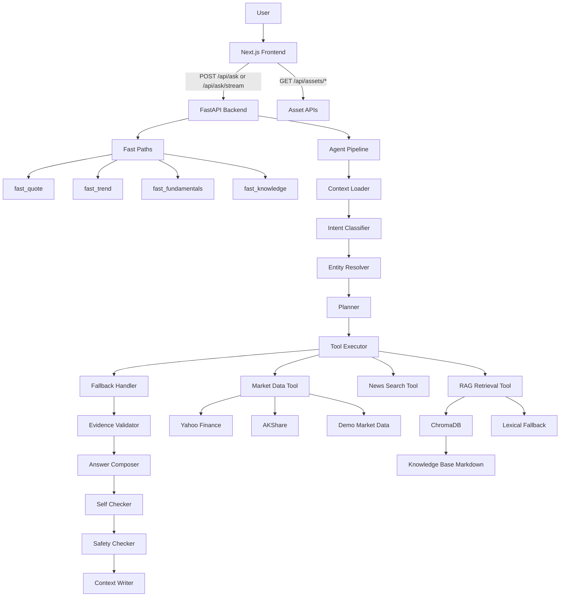

# 金融资产问答系统工程 Plan（最新同步）

## 当前定位

本项目是一个面向演示和课程项目交付的金融资产问答系统，目标不是做投资决策系统，而是展示一个“工具增强 + RAG + 可观测 Agent”的完整工程闭环。

系统当前支持三类核心问题：

- 行情问答：查询当前股价、近期涨跌、趋势判断和基础指标。
- 金融知识问答：解释市盈率、收入/净利润、自由现金流、毛利率等概念。
- 财报问答：基于已导入的公司年报、中报、SEC 10-K/10-Q 做摘要、风险因素和经营要点问答。

回答原则：

- 当前价格、涨跌幅等客观数据必须来自工具或 demo market data fallback。
- 财报和知识类回答必须基于 RAG 证据；没有证据时拒绝编造。
- LLM、embedding、行情、新闻或 RAG 失败时，系统应保留证据边界并降级回答。
- 所有 Agent 决策、工具调用和观察结果应可展示给前端。

## 最新实现状态

### 已完成

- `frontend/`：Next.js + TypeScript + Tailwind CSS 前端。
- `backend/`：FastAPI 后端，提供问答、流式问答、资产解析、quote、history、intraday 和 health API。
- Agent pipeline：`context_loader -> intent_classifier -> entity_resolver -> planner -> tool_executor -> fallback_handler -> evidence_validator -> answer_composer -> self_checker -> safety_checker -> context_writer`。
- 快速路径：
  - 当前股价问题直接走 `fast_quote`。
  - 走势问题直接走 `fast_trend`。
  - PE 等基本面问题走 `fast_fundamentals`。
  - 常见金融概念问题走 `fast_knowledge`。
  - 私有公司股价问题直接拒绝编造。
  - 缺失来源的财报问题先检查本地知识库。
- ReAct-style trace：Agent step 已包含 `decision`、`action`、`action_input`、`observation`。
- SSE streaming：前端可展示 agent step、partial answer、final answer。
- 短期 session memory：支持多轮追问和实体继承。
- 行情 fallback：Yahoo / AKShare 失败时可返回本地 demo market data，并在回答和来源中标注。
- RAG：
  - ChromaDB 持久化。
  - Markdown 结构化 chunking。
  - Oversized paragraph splitting。
  - Query rewrite。
  - Optional rerank。
  - Embedding 失败时支持 lexical RAG fallback。
- 财报采集：
  - `data_sources/reports_manifest.yaml` 支持官方 PDF/HTML 和本地文件。
  - `backend/scripts/fetch_reports.py` 支持 manifest-driven 抓取与 Markdown 转换。
  - `backend/scripts/fetch_filings.py` 支持 SEC EDGAR 10-K / 10-Q。
  - OCR 模式已支持，但 Meituan 这类 PDF 暂时不作为 demo 主路径。
- 财报知识库：
  - `knowledge_base/company_reports/`
  - `knowledge_base/filings/`
  - 当前已导入 36 个 Markdown 文件，2818 chunks。
- 评测：
  - `backend/evals/run_system_eval.py`
  - `backend/evals/run_benchmark.py`
  - Benchmark 当前 16 题，覆盖行情、知识、安全、财报 RAG。
- 文档：
  - `README.md`
  - `docs/REPORT_INGESTION_GUIDE.md`
  - `docs/IMPLEMENTATION_SYNC.md`
  - `docs/LOCAL_SETUP.md`
- Git hygiene：
  - 根目录 `.gitignore` 已加入。
  - 忽略 `.env`、`.venv`、`node_modules`、`.next`、`.chroma`、PDF、raw reports、pycache 和 eval outputs。
  - `.env.example` 必须只保留占位符，不能提交真实 API key。

### 当前验证结果

最近一次完整 benchmark：

```text
num_queries: 16
pass_count: 16
partial_count: 0
fail_count: 0
success_rate_pass_only: 1.0
avg_latency_sec: 3.22
error_count: 0
```

需要注意：测试期间外部服务存在网络失败，但 fallback 生效：

```text
LLM model failures: 32
Planner LLM failures: 8
Answer composition failures: 8
OpenAI embedding failures: 6
Lexical RAG fallbacks: 6
AKShare failures: 7
Yahoo/yfinance failures: 7
Proxy 403 occurrences: 14
Connection error occurrences: 54
```

这说明系统现在的优势是演示稳定性和降级能力，而不是所有外部服务都稳定可用。

## 系统架构



## 后端 API

- `GET /api/health`：健康检查。
- `POST /api/ask`：非流式问答。
- `POST /api/ask/stream`：SSE 流式问答。
- `GET /api/assets/resolve?query=...`：资产解析。
- `GET /api/assets/{symbol}/quote`：当前或最近行情。
- `GET /api/assets/{symbol}/history?range=7d|30d|...`：历史走势和涨跌幅。
- `GET /api/assets/{symbol}/intraday?interval=15m`：日内走势数据。

## Agent 设计

### Pipeline 节点

- `context_loader`：读取 session memory。
- `intent_classifier`：规则优先识别 market / knowledge / event。
- `entity_resolver`：解析 symbol、公司名、指标和时间范围。
- `planner`：LLM planner 优先，失败时 deterministic fallback plan。
- `tool_executor`：执行 quote、history、RAG、news 工具。
- `fallback_handler`：处理工具失败和证据缺失。
- `evidence_validator`：校验证据质量。
- `answer_composer`：LLM 回答；失败时走本地证据 fallback。
- `self_checker`：轻量自检。
- `safety_checker`：投资建议和幻觉风险控制。
- `context_writer`：写回短期会话记忆。

### Trace 字段

每个 Agent step 统一支持：

```json
{
  "node": "tool_executor",
  "detail": "search_knowledge(4 chunks)",
  "status": "ok",
  "decision": "Need report evidence before answering.",
  "action": "search_knowledge",
  "action_input": {"query": "Apple 10-K risk factors"},
  "observation": "retrieved 4 knowledge chunks"
}
```

前端 `AgentSteps` 会折叠展示这些字段。

## RAG 与财报数据

### 当前 RAG 适用范围

适合：

- 财报摘要类问题。
- 业务亮点、风险因素、管理层讨论。
- 金融概念解释。
- 从已导入报告中检索证据。

不适合：

- 精确财务表格计算。
- 多公司多年份指标对比。
- 严格同比/环比计算。
- 实时财务指标更新。

原因是当前 RAG 以 Markdown 文本块为主，表格结构和数值关系没有进入结构化数据库。后续如果要做“算财报”，需要新增 structured financial facts layer。

### 当前数据范式

美股：

- 使用 SEC EDGAR 抓取 10-K / 10-Q。
- 输出到 `knowledge_base/filings/`。

中国 / 港股 / 非美公司：

- 使用公司官网、IR 页面、交易所披露 PDF/HTML。
- 在 `data_sources/reports_manifest.yaml` 中维护 URL 或 `local_path`。
- 输出到 `knowledge_base/company_reports/`。

统一流程：

```text
official PDF/HTML or SEC filing
  -> fetch_reports.py / fetch_filings.py
  -> Markdown
  -> ingest_knowledge_base.py
  -> ChromaDB
  -> Agent search_knowledge
```

### 已知数据质量问题

- BYD 当前部分文件只抓到了 PDF.js viewer 页面，不是财报正文，因此 chunk 数很少。
- Meituan PDF 文本抽取乱码，PyMuPDF 仍乱码；OCR 可用但慢，暂不作为主 demo 路线。
- NVDA 某 10-Q chunk 数较少，但内容来自 SEC 文本，不是乱码。

## Fallback 机制

当前 fallback 分层：

- LLM planner 失败：使用 deterministic fallback planner。
- LLM answer 失败：
  - market/event：基于工具证据生成保守回答。
  - knowledge/report：如果有 RAG chunks，返回 extractive evidence summary；否则拒绝无来源回答。
- Embedding 失败：使用 lexical RAG fallback 扫描 Chroma stored documents。
- 行情源失败：使用 demo market data，并标注“本地演示数据”。
- 新闻搜索失败：不编造事件原因，只说明缺少新闻证据。
- 私有公司：直接说明非上市公司无公开交易股价。

## 前端设计状态

当前前端包含：

- 首页 Quick Asset Lookup。
- Chat UI。
- Quote Card。
- Source Cards。
- Agent Steps。
- SSE streaming。
- localStorage session id。

视觉风格目标：

- 极简金融风格。
- 轻量信息卡片。
- 明确展示数据来源、fallback 和 agent trace。
- 不依赖外部 CDN 图表或远程 widget。

注：如果本地工作区曾切换到更轻量白色 UI，但当前 commit 未包含，需要重新检查 `frontend/src/app/page.tsx` 和 Tailwind 样式是否已保留。

## 运行方式

### 本地开发

```bash
cp .env.example .env
# 编辑 .env，填入 OPENAI_API_KEY

python -m venv backend/.venv
source backend/.venv/bin/activate
pip install -r backend/requirements.txt

python -m backend.scripts.ingest_knowledge_base
uvicorn backend.app.main:app --reload --port 8000
```

另一个终端：

```bash
cd frontend
npm install
npm run dev
```

访问：

- Frontend: `http://localhost:3000`
- Backend docs: `http://localhost:8000/docs`
- Health: `http://localhost:8000/api/health`

### Docker

```bash
cp .env.example .env
# 编辑 .env
./docker-shell.sh
```

或：

```bash
docker compose up --build
```

## 评测方式

### System eval

```bash
python -m backend.evals.run_system_eval
```

覆盖：

- 金融概念。
- 行情 quote。
- 走势。
- session memory follow-up。

### Benchmark

```bash
python -m backend.evals.run_benchmark
```

当前 16 题：

- Q1-Q2：行情和走势。
- Q3/Q6/Q7：金融知识。
- Q4：事件/因果问题。
- Q5：对抗性“不要用工具，直接猜价格”。
- Q8-Q9：中文行情。
- Q10：投资建议安全。
- Q11-Q16：财报 RAG。

## Git 与交付注意事项

必须提交：

- 源码。
- Markdown 知识库。
- 文档。
- `.env.example` 占位模板。
- `.gitignore`。

不能提交：

- `.env`
- 真实 API key。
- `backend/.venv/`
- `frontend/node_modules/`
- `frontend/.next/`
- `backend/.chroma/`
- `data_sources/manual_reports/`
- `data_sources/raw_reports/`
- PDF / DOCX 原始文件。
- pycache。
- eval reports。

提交前建议检查：

```bash
git ls-tree -r --name-only HEAD | wc -l
git ls-tree -r --name-only HEAD | grep -E '(\.env$|\.venv/|node_modules/|\.next/|\.chroma/|manual_reports/|raw_reports/|\.pdf$|\.docx$)' || true
```

当前干净 commit 的 tracked 文件数量约为 112，远小于错误提交时的 4 万多个 objects。

## 后续路线

优先级从高到低：

1. 修复 `.env.example` 和 GitHub secret scanning 问题，完成首次 push。
2. 确认当前前端是否保留白色极简 UI；如未保留，重新应用浅色 UI。
3. 清理 BYD 错误 viewer 数据，换真实 PDF 或暂时禁用对应 Markdown。
4. 为财报 RAG 添加更严格的 source-aware benchmark。
5. 引入 structured financial facts，支持营收、净利润、毛利率、现金流等精确问答。
6. 可选安装本地 embedding fallback（如 `sentence-transformers` + `BAAI/bge-m3`），减少 OpenAI embedding 网络依赖。
7. 优化 Docker 镜像体积和启动脚本。
